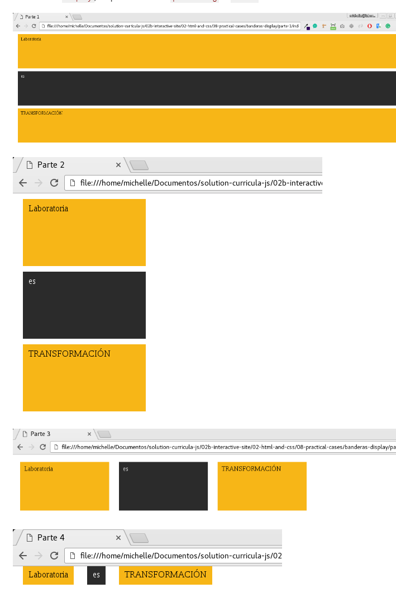

# BANDERAS DISPLAY

## Contenido:

*  Archivos adjuntos
*  Trabajo e imágenes

### Archivos adjuntos:

1.- ** Carpeta assets** que contiene nuestras imágenes.

2.- ** Carpeta css ** que contiene al archivo * main.css * .

3.-** Carpetas part1,part2,part3 y part4 ** las cuales contienen sus respectivos archivos *HTML* Y *CSS.*

4.- Archivo ** index.html. **

5.- ** README.md **

### Trabajo
PROBLEMA:
 -Replicar las siguientes imagenes poniendo en práctica nuestros conocimientos de display. Debemos utilizar únicamente display, no podemos utilizar positioning ni floats.

  Las  ** imagenes ** pueden verlos de ** dos ** maneras:
* [Imagenes](http://subefotos.com/ver/?673971ed5e016afe7973e596845f6682o.png)

* 
